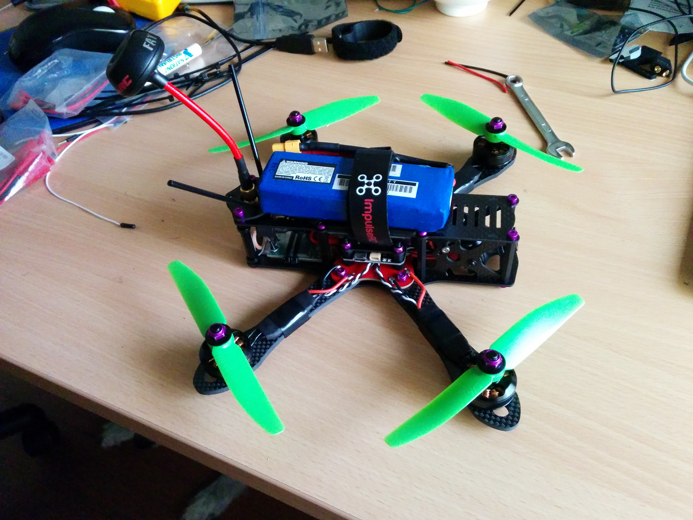
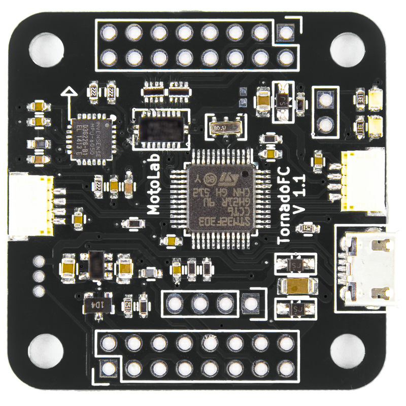
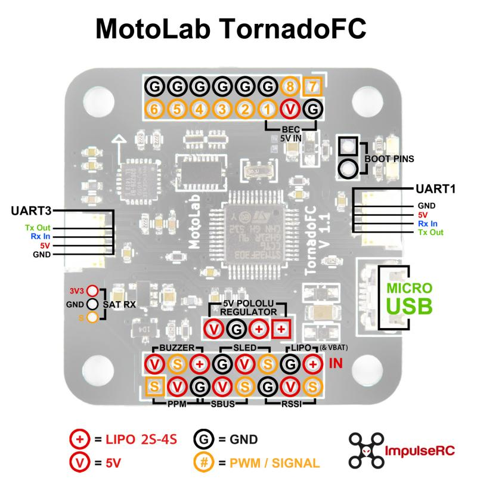

Alien 5"
========

The Alien is produced by ImpulseRC. From my perspective this is a high
quality product. The engineering is really good, lots of thought has gone
into this product from the designers.

Parts
-----

+---------------------+--------------------------------------------------+
| Part                | Description                                      |
+=====================+==================================================+
| Frame               | Alien 5" (225mm)                                 |
+---------------------+--------------------------------------------------+
| FC                  | Motolab Tornado STM32F3 (Betaflight 2.4.0)       |
+---------------------+--------------------------------------------------+
| ESC                 | :ref:`fvt-littlebee-20a-label` (BLHeli)          |
+---------------------+--------------------------------------------------+
| Motors              | Cobra 2204 2300kv                                |
+---------------------+--------------------------------------------------+
| Propellors          | :ref:`5045-hqprop-propellors-label`              |
+---------------------+--------------------------------------------------+
| Receiver            | Storm S603 (Spectrum Compatible)                 |
+---------------------+--------------------------------------------------+
| Flight Camera       | :ref:`hs1177-fpv-camera-label`                   |
+---------------------+--------------------------------------------------+
| Video Transmitter   | :ref:`200mw-immersionrc-video-transmitter-label` |
+---------------------+--------------------------------------------------+
| VTX Antenna         | FatShark 5.8 GHz SpiroNET RHCP                   |
+---------------------+--------------------------------------------------+
| On-Screen Display   |                                                  |
+---------------------+--------------------------------------------------+
| Batteries           | Zippy 1800mAh 3s 40C                             |
+---------------------+--------------------------------------------------+
| Voltage Regulators  | 5V Polulu D24V5F5 (powering FC)                  |
|                     | 12 BEC (powering camera)                         |
+---------------------+--------------------------------------------------+
| Goggles             | :ref:`fatshark-attitude-v3-goggles-label`        |
+---------------------+--------------------------------------------------+
| VRX Antenna         | FatShark 5.8 GHz SpiroNET RHCP                   |
+---------------------+--------------------------------------------------+
| Transmitter         | Spektrum DX6i                                    |
+---------------------+--------------------------------------------------+

As I don't have an OSD yet I have added a buzzer to provide a low battery
warning. I have to fly it near me occasionally to hear it. It is surpisingly
loud. I got a 9V - 14V buzzer and connected to the Lipo and buzzer signal
pins on the FC.

Flight Controller
-----------------

I am using the MotoLab Tornado F3 Flight Controller from ImpulseRC.

There are three separate power rails on the board.

Lipo voltage - Connected to a resistor network for VBAT monitoring and to the pads for an external switching regulator.
5V - Connected to the external regulator output, internal 3.3V regulator input, 5V PWM buffer, and external device interfaces including the SBUS and PPM receivers, 5V buzzer, serial LED and RSSI.
3.3V - Powers the CPU and gyro chip as well as the external DSM2/DSMX receiver on the SAT connector.

The Tornado does not have an on-board 5V regulator. 5V power may be sourced from an ESC BEC or from an external switching regulator. The board's 5V rail is expected to be provided by an external 5V regulator. ImpulseRC sell a 5V Polulu regulator to fulfill this need that perfectly fits the dedicated through-hole connectors provided for a 5V regulator.

Pinout Notes
++++++++++++

- Pins marked "+" are LIPO voltage. LIPO input voltage is limited to 6S, depending on the regulator used. Pololu recommends an external 33uF 50V capacitor for over 20V inputs.
- The LIPO IN pins are connected internally to the VBAT monitor.
- Pins marked "V" are +5V ONLY. Do not connect anything over 5V to these pins.
- All of the numbered pins are PWM outputs.
- The LIPO "+" and BEC "V" pins have reverse-current blocking diodes to prevent powering ESCs from USB power.
- To bypass the BEC "V" input diode and output 5V on this pin, short the two-pad jumper below the PWM 1 input.
- The Pololu switching regulator may be mounted on top or bottom of the board. Observe the orientation.
- If using an external 5V BEC of any kind (including a Pololu not mounted on the board), connect it to the pins labelled "BEC 5V IN".
- SAT RX and SBUS use UART 2.
- The "S" pin on the buzzer connection is the switched ground. Connect the + pin of the buzzer to either the lipo "+" or 5V "V" pin, and the - pin to "S".

SmartPort Telemetry
+++++++++++++++++++

Cleanflight and Betaflight can send Smartport telemetry to the FrSky X-series receivers over a single wire. Connect TXOUT from either serial port to the S.PORT pin on the receiver. It only takes one wire because the ground connection is already made with the SBUS cable. The voltage divider for lipo monitoring is built into the Tornado.

To enable lipo monitoring over Smartport:

Enable VBAT and Telemetry on the Config tab
Select Telemetry -> SmartPort and AUTO on the ports tab
Set telemetry_inversion=on in CLI (This is the default in later firmware)

The lipo voltage shows up in OpenTX as VFAS. The most useful telemetry parameters seem to be VFAS, RSSI, and RxBt (receiver input voltage).

Firmware
++++++++

The Motolab Tornado F3 comes with a version of Betaflight already installed.
This is fine to use but it is recommended to run the most recent version.
This will have fixes as well as new features.

The Motolab Tornado presents itself as a USB device that supports
DFU programming. DFU allows devices to have their firmware downloaded
and uploaded over a USB transport. To put the Motolab Tornado F3 into
bootloader mode, bridge the boot pins and connect the board to the USB.
The bridge only needs to be made as the USB connection is made and can
be removed after.

Once I enabled AIR_MODE I noticed that the quad would bob and bounce when I
tried to land. These issues seems to have been encountered by many others.
Until I find a good solution I bring the quad in close to the ground and then
quickly disarm it as I land.

A good example was captured in this YouTube video:

.. raw:: html

    <iframe width="560" height="315" src="https://www.youtube.com/embed/s7-EtdpZZqQ" frameborder="0" allowfullscreen></iframe>

Instructions
^^^^^^^^^^^^

#. Go to the betaflight `releases <https://github.com/borisbstyle/betaflight/releases>`_ page.
#. Download the betaflight_MOTOLAB.hex file.
#. Open CleanFlight Configurator.
#. Bridge the boot pins and connect the Tornado F3 to the USB.
#. The 'device' pull-down on Cleanflight Configurator should change to DFU.
#. Select the Firmware-Flasher tab.
#. Click the Load Firmware [Local] button and choose the
   betaflight_MOTOLAB.hex file just downloaded.
#. Click the Flash Firmware button and observe the progress bar and status.

Your FC should now be flashed with the latest betaflight firmware.

Configuration
^^^^^^^^^^^^^

Modes: AIR_MODE, ACRO_PLUS

Electronic Speed Controller (ESC)
---------------------------------

I am currently using the :ref:`fvt-littlebee-20a-label` ESC.

Batteries
---------

As I have 20A ESC's I need to be looking for a battery capable of discharging
at least 80A. So, I should be looking for a minimum of something along the
lines of:

 - 1300mAh 65C
 - 1800mAh 45C

From my previous ZMR250 I have 3 :ref:`zippy-1800-3s-40c-label` batteries.
The batteries that I'm using on my ZMR250, Zippy 40C (50C burst) 1800mAh
should be OK as a stop-gap until I get more suitable batteries for this
quad setup.

I recently got 3 Turnigy A-Spec 4S 1300 mAh 60C to use with this Alien build.
I notice some power improvement. I also notice that there is terrible noise
on my FPV video when running these batteries. I have a cheap 12V BEC that
supplies the camera power which I am suspecting is the culprit of the noisy
signal that is causing the video problems.

Receiver
--------

I am using a :ref:`s603-receiver-label`

Video Transmitter
-----------------

I am using the :ref:`200mw-immersionrc-video-transmitter-label`.

FPV Goggles
-----------

I am using the :ref:`fatshark-attitude-v3-goggles-label`.

Transmitter Configuration
-------------------------

I am using a Spektrum DX6i transmitter. The transmitter requires some
adjustment so as to configure the mid-points of the channels around the
1500 value and to configure the channel span to support approximately
1000 - 2000 as expected by Cleanflight.

The Motolab Tornado F3 can drive the receiver when powered by USB which
is convenient, meaning I don't need to plug in the battery to configure
the flight controller.

So, I connect the quad to Cleanflight Configurator, turn on the transmitter
then go to the receiver tab. In here I can see if the channels are configured
correctly.

When its all configured correctly I'm expecting to see the values move
right when I move the pitch up, the roll right and the yaw right. Initally
the values were not spanning the ranges expected by Cleanflight and some of
the channels moved the wrong way.

Reverse Channels
++++++++++++++++

Reverse Aileron and Rudder in Transmitter so that moving stick right on
transmitter moves the channel slider right in Cleanflight.

Travel Adjust
+++++++++++++

Adjust throttle travel to span approximately 1000 - 2000 in Cleanflight.
To achieve this I adjusted the travel as well as modify the sub-trim.

- Throttle: +109%

Sub-Trim
++++++++

Adjust sub-trim in Transmitter so that Roll, Pitch and Yaw are centered
around 1500.

- Throttle: down 27
- Aileron: left 29
- Elevator: down 28
- Rudder: left 54

Once these settings are made I noted the minimum and maximum throttle values
and then went back into the Configuration tab to update the min and max
throttle values.

When this was all done I could successfully arm and disarm the motors by using
the standard approach:

- Arm: min throttle and yaw right.
- Disarm: min throttle and yaw left.

FPV Camera
----------

With this quad setup I am using the :ref:`hs1177-fpv-camera-label`. However,
this unit is a custom unit from ImpulseRC. I think the only difference
from the standard HS1177 is that the ImpulseRC version has the cable
connector at the top left of the back instead of at the bottom.

The build instructions produced by ImpulseRC on their Youtube channel
show the camera being powered by the 5V regulated power output from a
ImmersionRC Video Transmitter. I am using the same video transmitter.

However, I found my camera just didn't produce a video signal when using
this configuration. I would just see a black screen in my goggles. This
was a real annoyance.

Removing all variables, I supplied the camera with 5V from a wall power
pack and connected it to my TV. The video signal would briefly show a
picture before blanking out then it would repeat this sequence forever.
If I increased the power to 9V then the video signal was steady and
reliable.

I had a ZMR250 PDB laying around so I removed the small 12 regulator
BEC from that, packaged it up nicely so it could sit logically inline
between the battery and the camera. Physically it connects to the
Alien PDB via JST connectors and sits between the camera and the central
flight controller stack.

I guess one good thing about this is that I should be able to run 3S
and 4S batteries without damaging the Camera. Apparently the camera has
a known issue running above 16V even though it states that it supports
up to 22V.

Settings
--------

Controller: Luxfloat
Looptime: ?

+----------------+---------+
| PID            | Value   |
+================+=========+
| Roll           |         |
+----------------+---------+
| Pitch          |         |
+----------------+---------+
| Yaw            |         |
+----------------+---------+

+----------------+---------+
| Rates          | Value   |
+================+=========+
| Roll Rate      |  0.70   |
+----------------+---------+
| Pitch Rate     |  0.70   |
+----------------+---------+
| Yaw Rate       |  0.40   |
+----------------+---------+
| TPA            |     0   |
+----------------+---------+
| TPA Breakpoint |  1500   |
+----------------+---------+

LED Ring
--------

The Alien supports an optional LED ring that is placed at the rear of the quad.

I came across a `flitetest <http://forum.flitetest.com/showthread.php?22417-ImpulseRC-Alien-build/page7>`_ forum post that covered the LED ring in ome detail.

From there I came across a good youtube video showing it off.

.. raw:: html

    <iframe width="560" height="315" src="https://www.youtube.com/embed/sQRhrbwMO7c" frameborder="0" allowfullscreen></iframe>

Properllors
-----------

So far I have used the following propellors on this build.

- :ref:`5030-gemfan-propellors-label`
- :ref:`5045-hqprop-propellors-label`
- :ref:`5046bn-gemfan-propellors-label`
