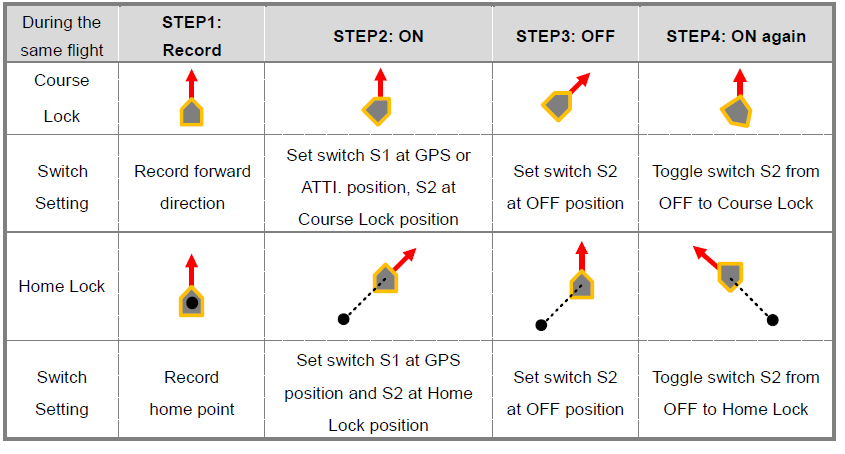

Flight Test
===========

This section covers the intial flight testing actions that I performed.

Starting the Motors
-------------------

Use the Combination Stick Commands (CSC) to start motors.
Simply pushing the throttle stick before takeoff will not start motors.
You have to execute any one of following four Combination Stick Commands
(CSC) to start motors.

.. figure:: ../software/resources/naza-m-csc.png

Status LED
----------

I'll typically be flying the GPS control mode so I wait until the status LED
is showing a single green flash. It typically starts out with red flashes
followed by a green and slowly the number of red flash dissappear as the
better GPS satellite lock is achieved.

See the LED status chart below for the different indicators.

.. figure:: ../software/resources/naza-m-led.png

Range Test
----------

TBD

IOC Test
--------

TBD

