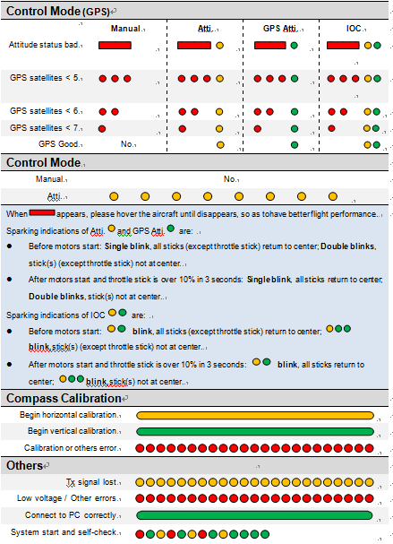
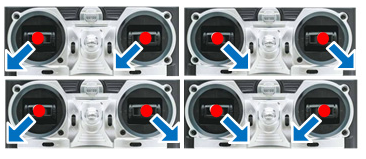

Flight Test
===========

This section covers the intial flight testing actions that I performed.

Calibrate Compass
-----------------

The compass only needs to be calibrated once though you should repeat it
if you make significant changes to the drone that might affect the compass.

Power on the quadcopter. Use the transmitter to quickly switch between GPS
mode and Manual mode 11 times. I have no idea what the correct strategy is
but this sequence seems to work for me.

The LED should change to a constant yellow which indicates the start of the
horizontal calibration. Keeping the quadcopter flat rotate it horizontally
around 360 degrees. Once the rotation is complete the LED should change to
green which indicates the start of the vertical calibration. Now orient the
quadcopter on its side and once again rotate it around 360 degress.

Once the final rotation is complete the LED should return to its normal
sequence for the current control mode.

Status LED
----------

To start with I'll typically be flying the GPS control mode so I wait
until the status LED is showing a single green flash. It typically starts
out with red flashes followed by a green and slowly the number of red flash
dissappear as the better GPS satellite lock is achieved.

See the LED status chart below for the different indicators.

When operating in GPS mode I wait for the quadcopter to find the GPS
satellites that cause it to show a single green flash.

Range Test
----------

TBD

Starting the Motors
-------------------

Use the Combination Stick Commands (CSC) to start motors.
Simply pushing the throttle stick before takeoff will not start motors.
You have to execute any one of following four Combination Stick Commands
(CSC) to start motors.

Transmitter Failsafe Test
-------------------------

Power on the quadcopter and fly striaght up a metre or two. Turn off the
transmitter which will trigger the receiver to go into the configured
failsafe setting. I had previously configure the throttle setting to be
about 30% which upon testing was too low as the quadcopter came down very
quick. I need to set it to a value that causes the quadcopter to very slowly
descend.

IOC Test
--------

I have previously set the NAZA Failsafe Settings to "Go-Home and Landing".

Out in the field power up the quadcopter and let it establish a home position
lock. When an appropriate number (7+ according to DJI's LED status overview,
see the section above about the LED) of GPS satellite are detected the status
LED flashes a single green flash on the LED status indicator.

The current position of the quadcopter will be automatically recorded as the
home point when the throttle is first moved after 6 or more GPS satellites
have been found.

The NAZA will record the current nose direction as forward direction at the
30th second after you power on the multi-rotor. The LED will blink a sequence
of green flashes quickly when the home location is successful.

Once the quad has established the home position fly it some distance away,
it doesn't have to be far. The first time I tried it I only moved about 5m
away.

In my configuration I use the ELEV D/R switch to move the control mode into
Failsafe. Flick the ELEV D/R switch. The quad should go up to 20m and move
back to the home location before descending.

