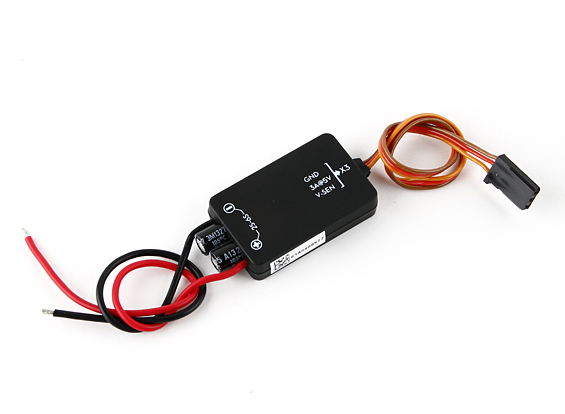

Hardware
========

This section of the documentation covers how I installed the MC and the
associated GPS receiver, LED status device and connected the Spektrum AR610
receiver that came with the Spektrum DX6i transmitter.

Flame Wheel F450
----------------

My F450 came with red and white motor struts. There was no instruction about
which color should be used for the front and the rear and I didn't find any
common convention from some brief internet searches. I used the white struts
for the two front motors and the red struts for the two rear motors.

Motors
++++++

The F450 is a QuadRotorX configuration and when coupled with the NAZA M the
motor numbering is as follows:

.. code-block:: console

    2   1
     \ /
      X
     / \
    3   4

The DJI propellors use a color coding to help identify which motor they should
be used on. Propellors with a silver color at the centre are for the counter
clockwise (CCW) motors and propellors with a black centre are for the
clockwise (CW) motors.

=====  =========  ==========
Motor  Direction  Prop Color
=====  =========  ==========
1      CCW        Silver
2      CW         Black
3      CCW        Silver
4      CW         Black
=====  =========  ==========

Once the motors were connected to the ESC's and mounted I tested their spin
direction using a very flimsy piece of paper. By gently bringing the piece of
paper to the spinning motor it will get pull to the spin direction.

If any of the motors are spinning in the wrong direction switch two of the
ESC wires to alter the direction.

DJI NAZA-M LITE
---------------

The NAZA-M LITE provides the brains of the quadcopter. It comes as a set of
discrete devices that are covered in more detail below.

MC
+++

The Main Controller (MC) is the brains of the flight system. The MC connects
to the motor controllers (ESC) and the remote control receiver.

The MC has a built-in Inertial Measurement Unit (IMU) that consists of one
3-axis accelerometer, one 3-axis gyroscope and a barometer for sensing the
attitude and altitude.

The MC should be placed as close as possible to the center of the frame. The
line on the top of the MC should be aligned with the center line of the craft
and should be pointing to the nose. This will result in the motor ports facing
the front of the craft.

The MC came with lots of 3M double sided tape strips which I used to stick it
in place to the F450 base plate. I connected the motor wires before sticking
the MC in place.

Connections
^^^^^^^^^^^

=======  =======  ========  ========  ==============
NAZA MC  NAZA VU  NAZA LED  NAZA GPS  Spektrum AR610
=======  =======  ========  ========  ==============
A                                     AILE
E                                     ELEV
T                                     THRO
R                                     RUDD
U                                     GEAR
X1
X2                                    AUX1
X3       VU
LED               LED
EXP                         GPS
=======  =======  ========  ========  ==============

VU
+++

The VU device monitors the battery Voltage and provides a regulated power
feed to the MC.

The VU device can be connected to a variety of batteries from a 2S (7.2V) to
a 6S (26.0V). I have a 2200mAh 3S battery.

The VU module connects to the X3 port on the MC.

GPS
+++

The GPS/Compass module provides the MC with position and direction information.

The NAZA logo marked on the module should face the sky and the orientation
arrow should point forward.

The GPS/Compass module came with a little carbon rod and two end pieces. I
glued the end pieces to the carbon rod and stuck the GPS/Compass module to the
top using a piece of 3M double sided tape. I then secured the base to one of
the rear facing motor struts using the strut screws. This placed it towards
the back of the craft close to the EXP port on the MC that it plugs in to. All
the loose cable was secured with cable ties to make it tidy.

LED
+++

The LED unit provide visual status while operating the quadcopter and the
USB interface for connecting the MC to the NAZA Software Assistant program.

.. figure:: resources/dji-naza-led.jpg

Spektrum DX6i Transmitter
-------------------------

I am using a Spektrum DX6i transmitter.

Spektrum AR610 Receiver
-----------------------

The DX6i came with a AR610 receiver so I'm using that on this quadcopter.

Binding
+++++++

Follow the bind procedure detailed in the section :ref:`binding-receiver-label`.

Now that the receiver is bound the actions on the transmitter will be relayed
to the receiver and passed on to the MC. We can now start configuring the
transmitter settings.

Battery Charger
---------------

I have purchased a Casal C66 battery charger. This takes a DC input anywhere
from 11 - 30V. I can easily use this charger at home and, more importantly,
I can take this charger along with a small 12V battery to the park so I can
charge a battery while I'm flying with the other one.

I cut the end off the fly-lead and soldered on a EC3 connector matching my
batteries.

It seems that the XT60 connector is the one primarily used in the quadcopter
community so I'll be using that on my next quadcopter.

Mini-S OSD
----------

For FPV flying I bought the Mini-S OSD on eBay from gadgetextreme primarily so
I could see the battery voltage while flying FPV. The OSD is covered in the
:ref:`mini-s-osd-label` section of the FPV section.

