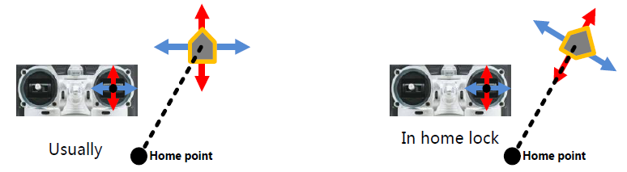

Advanced
========

This section of the documentation covers how I configured settings in the
Advanced panel of the DJI NAZA-M LITE Assitant application.

Motor
-----

In this area of the Advanced Panel you can alter the motor idle speed and set
motor cut-off type.

Motor Idle Speed
++++++++++++++++

The Motor Idle Speed can be modified between 5 different settings, from Low
through to High.

I left mine set to Recommended which is the default setting.

Cut Off Type
++++++++++++

The motor Cut Off Type can be altered between Immediately and Intelligent.

I set mine to Intelligent.

Immediate
^^^^^^^^^

When the Cut Off Type is set to Immediate, once the motors have started
and the throttle has gone over 10% then the motors will stop immediately
(irrespetive of Control Mode; e.g. GPS Atti, Manual) when the throttle stick
is brought back under 10% again.

In this mode if you move the throttle stick over 10% within 5 seconds of the
motors stopping the motors will re-start (no CSC action is needed).

Intelligent
^^^^^^^^^^^

In this mode different control modes use different ways of stopping the
motors.

In Manual Mode, only executing the CSC action can stop motors. In Atti Mode
or GPS Atti Mode, any one of following four cases will stop motors:

  #. You don’t push throttle stick after motors start in three seconds.

  #. Executing CSC.

  #. Throttle stick under 10% for more than 3 seconds and after 3 seconds
     landing.

  #. The slope angle of the multi-rotor is over 70°, and throttle stick under
     10%.

Failsafe Settings (F/S)
-----------------------

TBD

Intelligent Orientation Control (IOC)
-------------------------------------

Typically when flying a multi-rotor drone the forward direction remains
aligned with the direction that the nose is pointing. The Intelligent
Orientation Control (IOC) settings let you change this using two different
approaches. The first is called Home Lock and the second is called
Course Lock.

Home Lock
+++++++++

When the Naza MC is switched to Home Lock IOC mode the forward direction
of the multi-rotor always points away from the home point. Conversely, the
backward direction always moves back toward the Home Lock position.

.. note::

    The multi-rotor must be in ATTI or GPS mode and be further than 10m away
    from the home point.

There are 2 ways to record the forward direction in Home Lock mode;
automatically and manually.

The current position of the quadcopter will be automatically recorded as the
home point when the throttle is first move AFTER 6 or more GPS satellites have
been found.

After 6 or more GPS satellites have been found a new home position can be
manually set by toggling between Course Lock and Home Lock quickly 3 - 5
times.

Course Lock
+++++++++++

When the Naza MC is switched to Course Lock IOC mode the forward direction
is always that of the recorded nose direction.

.. figure:: ../resources/naza-m-ioc-course-lock.png

There are 2 ways to record the forward direction in Course Lock mode;
automatically and manually.

When in course lock mode the forward direction will be automatically recorded
30s after starting the quadcopter.

To manually set the forward direction toggle quickly between Course Lock and
Off 3 to 5 times (Off -> Course Lock -> Off represents one transition).
