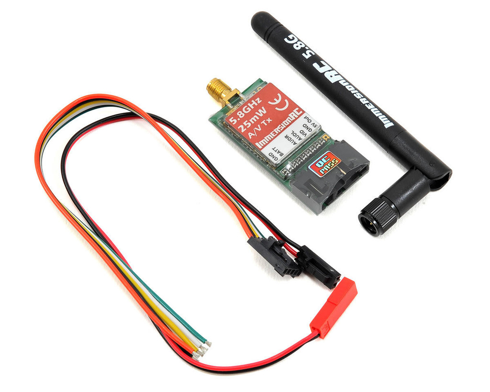
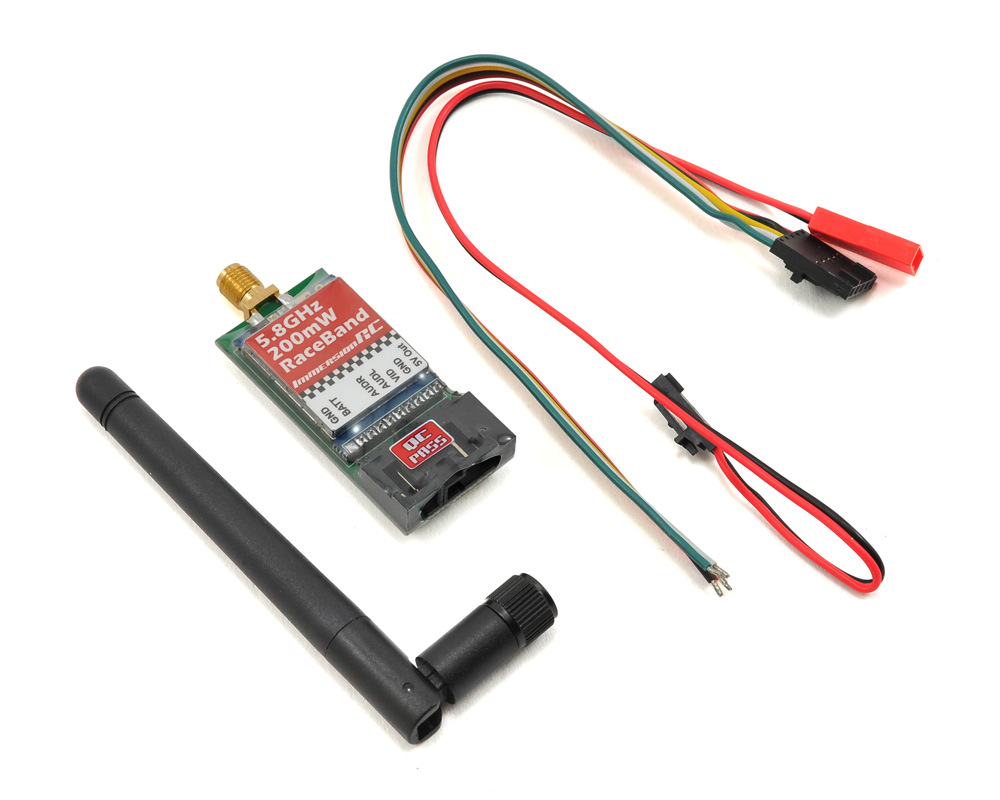
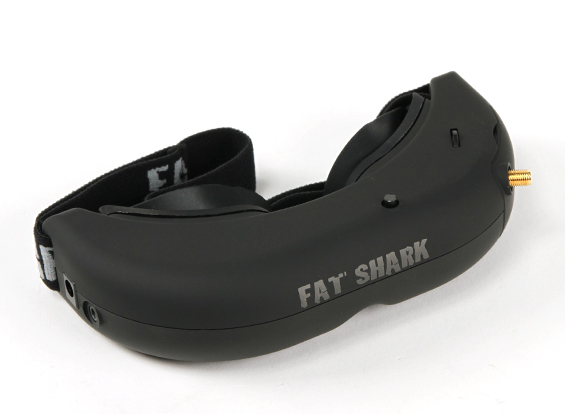
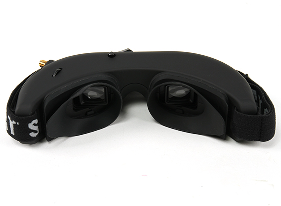
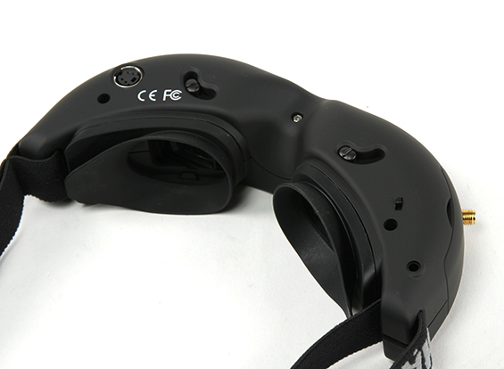
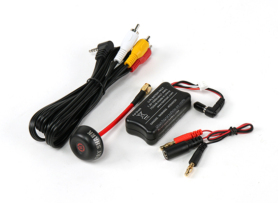
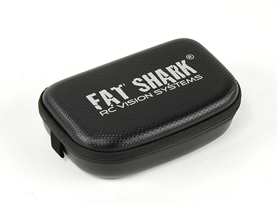
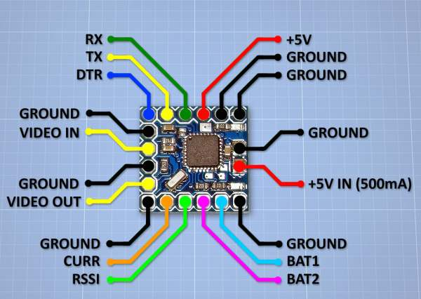
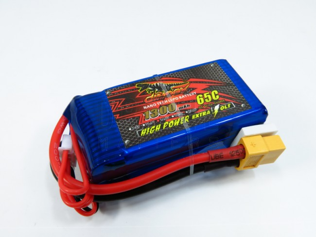
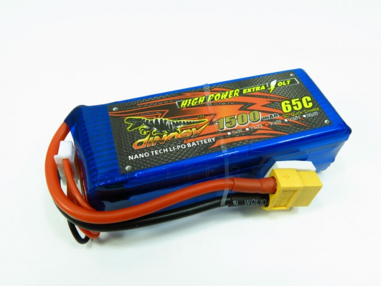

Parts
=====

This section covers some of the parts I have used on one or more
quads.

Transmitter
-----------

.. _spektrum-dx6i-label:

Spektrum DX6i
+++++++++++++

Video Transmitters
------------------

.. _25mw-immersionrc-video-transmitter-label:

ImmersionRC 5.8GHz 25mW Video Transmitter
+++++++++++++++++++++++++++++++++++++++++

The dip switches on the back were covered by the clear heat shrink so I
used a craft knife to gently trim it away so I could change the switch
settings when needed.

Switch 4 is unused on this 25mW unit. The dip switch channel mapping is as
follows:

=======  ===============  === === === ===
Channel  Frequency (GHz)  1   2   3   4
=======  ===============  === === === ===
1        5.74             On  On  On  X
2        5.76             Off On  On  X
3        5.78             On  Off On  X
4        5.80             Off Off On  X
5        5.82             On  On  Off X
6        5.84             Off On  Off X
7        5.86             On  Off Off X
=======  ===============  === === === ===

Swapping the standard antenna for a SpiroNET style antenna makes this unit
much more usable.

.. _200mw-immersionrc-video-transmitter-label:

ImmersionRC 5.8GHz 200mW Video Transmitter
++++++++++++++++++++++++++++++++++++++++++

This unit provides the same IRC/FS channels as the 25mW unit plus another 8
channels called RaceBand. These channels are much more widely spaced.

IRC/FS

=======  ===============  === === === ===
Channel  Frequency (GHz)  1   2   3   4
=======  ===============  === === === ===
1        5.74             On  On  On  Off
2        5.76             Off On  On  Off
3        5.78             On  Off On  Off
4        5.80             Off Off On  Off
5        5.82             On  On  Off Off
6        5.84             Off On  Off Off
7        5.86             On  Off Off Off
=======  ===============  === === === ===

RaceBand

=======  ===============  === === === ===
Channel  Frequency (GHz)  1   2   3   4
=======  ===============  === === === ===
1        5.658            On  On  On  On
2        5.695            Off On  On  On
3        5.732            On  Off On  On
4        5.769            Off Off On  On
5        5.806            On  On  Off On
6        5.843            Off On  Off On
7        5.880            On  Off Off On
8        5.917            Off Off Off On
=======  ===============  === === === ===

.. _fatshark-attitude-v3-goggles-label:

FatShark Attitude V3 FPV Goggles
--------------------------------

These googles are light weight and for me where a slightly cheaper
alternative to the more expensive Dominator variant.

The goggles support DC in from 7 to 13V (e.g. 2S or 3S bttery). They have
little screens that support VGA 640 x 480 pixels and provide a FOV of
32 degrees diagonal. They support adjustable inter pupil distance (IPD). They
have a built in head tracker (that I'll never use) and are capable of showing
a 3D video. They are compatible with the Fat Shark fan equipped faceplate too.

On the top left (above the antenna connector) of the goggles is the channel
rocker switch. This switch can be rocked side to side to move sequentially
through the available channels. An short audio beep is emitted when the
channel changes. A long audio beep is emitted when the channel limit (top
or bottom) has been reached. This rocker switch can also be pressed to reset
the head tracker.

In the middle is the display control 4-way rocker switch. This is used to
control the brightness and contrast: left and right increases and decreases the
display contrast while forward and back increases and decreases the display
brightness.

On the right hand side is the power input and a composite output connector for
displaying the video/audio feed on a TV etc.

They come with the following:

 - a 1000mAh 7.4V Lipo battery,
 - a charging cable,
 - a Spironet right hand polarised antenna,
 - an AV cable,
 - a 5.8GHz 32 channel modular receiver supporting ImmersionRC/Fatshark,
   A, E and Race bands.
 - a zipper carry case.

The goggles have a switch that allows the internal receiver to be turned off.
This is convenient when using the goggles with an external receiver which
feeds a video signal into the goggles via the

Using the dip switches on the receiver the various bands can be selected.

======  ====  =====================  ====  ====  ====  ====  ====  ====  ====  ====
Switch  Band  Name                   CH1   CH2   CH3   CH4   CH5   CH6   CH7   CH8
======  ====  =====================  ====  ====  ====  ====  ====  ====  ====  ====
0-0     1     Fat Shark/ImmersionRC  5740  5760  5780  5800  5820  5840  5860  5880
0-1     2     Band E  (Boscam E)     5705  5685  5665  5645  5885  5905  5925  5945
1-0     3     Band A  (Boscam A)     5865  5845  5825  5805  5785  5765  5745  5725
1-1     4     RaceBand               5658  5695  5732  5769  5806  5843  5880  5917
======  ====  =====================  ====  ====  ====  ====  ====  ====  ====  ====

I ended up purchasing the faceplate to replace the rubber eye-cups. This makes
the goggles much more comfortable to wear.

FPV Cameras
-----------

.. _hs1177-fpv-camera-label:

Surveilzone HS1177 Sony Super HAD II 600TVL
+++++++++++++++++++++++++++++++++++++++++++

The Sony HS1177 Super HAD II CCD 600TVL camera supports power from 5-22V and
has a 2.8mm lens which provides approximately 130 degree field of view.  It
seems to have a good reputation in the FPV community.

The HS1177 FPV camera comes with a short On-Screen Display (OSD) controller
cable with some connectors on the end. These connectors are common for
security cameras and can be `confusing <http://paulnurkkala.com/surveilzone-hs1177-sony-600tvl-tuning-cable-modifications/>`_ for the lay-person
from the quadcopter community.

I happened to have a BNC to RCA adapter laying around from an old security
camera setup. This converts the video signal onto a connector style that I
can more easily connect to other equipment such as a TV. I also had a
reconfigurable wall-wart power adapter that had the appropriate barrel power
connector.

The only modification I made to the camera was to set the Wide Dynamic
Range setting to ON as this prevents very bright objects (such as clouds)
from causing other areas (e.g. the ground) in the view from becoming very
dark.

.. code-block:: console

    Exposure -> DWDR --> ON

Once the focus is set it can be useful to hot-glue the focus locking ring
into place as the intense vibrations present at all times on the quadcopter
can work it loose over time.

Eachine TX01
++++++++++++

This is a 25mW 5.8GHz 40 channel FPV transmitter that I bought this unit as
the camera for a Tiny Whoop setup.

A short press on the button cycles the currently selected band's channels.
A longer press (~2s) enters the band selector which cycles through the bands
A, B, E, F, and Race. A long press (~5s) cycles between on ('=') and off ('0').

Once selected the settings are saved and retained.

====  ======================  ====  ====  ====  ====  ====  ====  ====  ====
Band  Name                    CH1   CH2   CH3   CH4   CH5   CH6   CH7   CH8
====  ======================  ====  ====  ====  ====  ====  ====  ====  ====
A     Band A                  5865  5845  5825  5805  5785  5765  5745  5725
b     Band B                  5733  5752  5771  5790  5809  5828  5847  5866
E     Band E                  5705  5685  5665  5645  5885  5905  5925  5945
F     Band F (Fat Shark/IRC)  5740  5760  5780  5800  5820  5840  5860  5880
r     RaceBand                5658  5695  5732  5769  5806  5843  5880  5917
====  ======================  ====  ====  ====  ====  ====  ====  ====  ====

Receivers
---------

.. _s603-receiver-label:

S603 Receiver
+++++++++++++

This receiver is a cheap alternative for a Spectrum branded receiver. These
can be found on sites like `banggood <http://www.banggood.com>`_. I have
ended up removing the receiver from its protective shell, remove all the pins,
solder wires directly to the PPM pins and then wrap it in some clear
heatshrink.

Bind Procedure
^^^^^^^^^^^^^^

#. Ensure transmitter is off.
#. Insert bind plug into Bind port in S603.
#. Power up the S603 using 5 - 8 Volts supply. I used the PPM input lead to
   my Naze32.
#. The S603 should power up and the LED should be flashing.
#. Remove the bind plug from the S603.
#. Ensure that the throttle and Aux channel is set to desired failsafe
   position on the transmitter.
#. Turn on transmitter while holding down the bind switch (on my DX6i this
   is the Trainer switch). Keep holding it until the S603 LED goes steady.
   For me it transitioned through flashing fast, off, slow flashing before
   finally going steady. Sometimes it takes a few tries before it is set
   properly. If it doesn't end up with a steady LED then just repeat the
   procedure until it works.
#. That's it. Done.

On-Screen Displays
------------------

.. _micro-minim-osd-label:

Micro Minim OSD
+++++++++++++++

The Micro MinimOSD is pretty much the same as the MinimOSD only smaller. It
has a 16x16mm size. It supports monitoring two batteries up each up to 4S
size. It supports monitoring current too.

The information displayed by the OSD appears to be highly configurable
though I am only planning on using it to overlay the battery voltage.

The board requires an external 5V supply. I can provide this from the
5V output on the ImmersionRC Video Transmitter that I am using.

I found a `site <http://blog.oscarliang.net/minimosd-micro-setup-naze32-pid-rssi/>`_
showing how someone had used 90 degree header pins to reduce the overall
volume required by the OSD when installed. This looks pretty good so
I might just do the same thing. The pin out would end up looking
something like this:

===   ====  ===  ====  ===  ===
 1     2     3    4     5    6
===   ====  ===  ====  ===  ===
GND   BAT1  Cur  RSSI  Vi   Vo
GND   GND   5V   RX    TX   DTR
===   ====  ===  ====  ===  ===

This layout provides the ability to access the FTDI pins to reconfigure
the OSD and the most important (to me) sensor and video pins.

Action Cameras
--------------

.. _xaomi-yi-label:

Xiamoi Yi
+++++++++

The Xiamoi Yi is a cheap HD action camera similar to a GoPro. It provides
a much cheaper option than a GoPro and hence can be put into harms way
with less concern.

First step is to ensure you have the latest firmware running. Use this
`link <http://www.xiaoyi.com/update/sports>`_.

A script exists to manipulate the camera to enable a feature like super view
on a GoPro as well as increase the bit rate. Apparently the Yi's sensor is
1600x1200. When it records in 1080 (16:9) resolution it simply crops the
image from 1600 to 1080. This cropping results in the vertical field of view
being reduced, which can be undesirable.The script enables the whole sensor to
be used but also results in a 4:3 resolution. The Yi takes this 4:3 image and
stretches it to fit the 16:9 1080 frame resolution. This results in some
distortion.

Here is the `script <http://fpvlab.com/forums/showthread.php?45118-Xiaomi-Yi-Enhanced-for-FPV-ers-(Script-Compilation>`_.

.. _propellors-label:

Propellors
----------

.. _5030-gemfan-propellors-label:

5030 Gemfan
+++++++++++

These are cheap flimsy propellors which were ideal while I was learning
how to fly. They are pretty forgiving, in many crashes they did not break.
I bought a pack of 20 from an eBay store.

.. _5045-hqprop-propellors-label:

5040 HQProp
+++++++++++

These propellors feel better quality than the Gemfans. They feel firmer,
less give. However, these propellors break very easily in a crash.

.. _5046bn-gemfan-propellors-label:

5046BN Gemfan
+++++++++++++

These propellors were great while they lasted. I had been using the Gemfan
5030 while learning to fly and once I started getting better I gave these
a go. These propellors seemed a bit more responsive, perhaps because of
their pitch and also they are thicker. They were surprisingly quiet.

.. _5045x3-gemfan-propellors-label:

5045 Triblade Gemfan
++++++++++++++++++++

Electronic Speed Controllers
----------------------------

.. _afro-12a-esc-label:

Afro 12A
++++++++

This ESC's use the SimonK bootloader and hence do not support the flight
controller pass-through programming method to update the ESC firmware.

.. _fvt-littlebee-20a-label:

FVT LittleBee 20A
+++++++++++++++++

Batteries
---------

.. _zippy-1800-3s-40c-label:

Zippy 1800mAh 3S 40C
++++++++++++++++++++

I bought these batteries for my ZMR250. I also use these on my Alien 5" too.
They are rated as capable of 50C bursts.

.. _tunigy-1800-4s-60c:

Tunigy A-Spec 1300mAh 4S 60C
++++++++++++++++++++++++++++

These are compact little batteries. I definitely feel the power difference
capared to the 3S batteries I have. These batteries recommended charging at
1C was is really slow.

.. _dinogy-14.8v-1300mah-65c-label:

Dinogy 1300mAh 4S 65C
+++++++++++++++++++++

I bought these batteries from banggood.com. They are more compact than
similarly specified batteries from other vendors. They support charge
rates up to 5C which is convenient. However, on the back they recommend
charge rates of 1C to 3C. Inconsistent.

.. _dinogy-14.8v-1500mah-65c-label:

Dinogy 1500mAh 4S 65C
+++++++++++++++++++++

I bought these batteries from banggood.com. They are more compact than
similarly specified batteries from other vendors. They support charge
rates up to 5C which is convenient. However, on the back they recommend
charge rates of 1C to 3C. Inconsistent.

